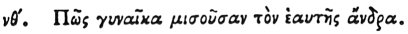

  
[Intangible Textual Heritage](../../index)  [Egypt](../index) 
[Index](index)  [Previous](hh131)  [Next](hh133) 

------------------------------------------------------------------------

[Buy this Book at
Amazon.com](https://www.amazon.com/exec/obidos/ASIN/1428631488/internetsacredte)

------------------------------------------------------------------------

*Hieroglyphics of Horapollo*, tr. Alexander Turner Cory, \[1840\], at
Intangible Textual Heritage

------------------------------------------------------------------------

p. 123

### LIX. HOW A WOMAN THAT HATES HER HUSBAND.

 

When they would symbolise *a woman that hates her own husband*, and
designs his death, and is complaisant only during intercourse, they
delineate a VIPER; for when in connexion with the male, she places his
mouth in her mouth, and after they have disjoined, she bites the head of
the male and kills him.

------------------------------------------------------------------------

[Next: LX. How They Denote Children Plotting Against Their
Mothers](hh133)
