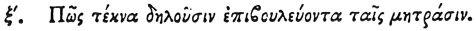

  
[Intangible Textual Heritage](../../index)  [Egypt](../index) 
[Index](index)  [Previous](hh132)  [Next](hh134) 

------------------------------------------------------------------------

[Buy this Book at
Amazon.com](https://www.amazon.com/exec/obidos/ASIN/1428631488/internetsacredte)

------------------------------------------------------------------------

*Hieroglyphics of Horapollo*, tr. Alexander Turner Cory, \[1840\], at
Intangible Textual Heritage

------------------------------------------------------------------------

### LX. HOW THEY DENOTE CHILDREN PLOTTING AGAINST THEIR MOTHERS.

 

When they would denote *children plotting against their mothers*, they
delineate a VIPER; for the viper is not

p. 124

brought forth in the \[usual manner?\], but disengages itself by gnawing
through the belly of its mother.

------------------------------------------------------------------------

[Next: LXI. How They Denote a Man Who Sickens Under the Reproach of
Accusation](hh134)
