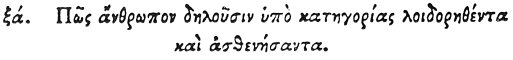

  
[Intangible Textual Heritage](../../index)  [Egypt](../index) 
[Index](index)  [Previous](hh133)  [Next](hh135) 

------------------------------------------------------------------------

[Buy this Book at
Amazon.com](https://www.amazon.com/exec/obidos/ASIN/1428631488/internetsacredte)

------------------------------------------------------------------------

*Hieroglyphics of Horapollo*, tr. Alexander Turner Cory, \[1840\], at
Intangible Textual Heritage

------------------------------------------------------------------------

### LXI. HOW THEY DENOTE A MAN WHO SICKENS UNDER THE REPROACH OF ACCUSATION.

 

When they would symbolise *a man who is reproached with accusations and
thence falls sick*, they delineate a BASILISK; for he kills those that
approach him with his breath.

------------------------------------------------------------------------

[Next: LXII. How a Man that is Burnt with Fire](hh135)
