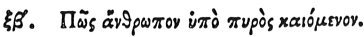

  
[Intangible Textual Heritage](../../index)  [Egypt](../index) 
[Index](index)  [Previous](hh134)  [Next](hh136) 

------------------------------------------------------------------------

[Buy this Book at
Amazon.com](https://www.amazon.com/exec/obidos/ASIN/1428631488/internetsacredte)

------------------------------------------------------------------------

*Hieroglyphics of Horapollo*, tr. Alexander Turner Cory, \[1840\], at
Intangible Textual Heritage

------------------------------------------------------------------------

p. 125

### LXII. HOW A MAN THAT IS BURNT WITH FIRE.

 

When they would symbolise *a man that is burnt with fire*, they depict a
SALAMANDER; for it destroys with either head.

------------------------------------------------------------------------

[Next: LXIII. How a Blind Man](hh136)
