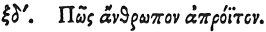

  
[Intangible Textual Heritage](../../index)  [Egypt](../index) 
[Index](index)  [Previous](hh136)  [Next](hh138) 

------------------------------------------------------------------------

[Buy this Book at
Amazon.com](https://www.amazon.com/exec/obidos/ASIN/1428631488/internetsacredte)

------------------------------------------------------------------------

*Hieroglyphics of Horapollo*, tr. Alexander Turner Cory, \[1840\], at
Intangible Textual Heritage

------------------------------------------------------------------------

### LXIV. HOW A MAN THAT NEVER STIRS OUT.

 

When they would symbolise *a man that never stirs* 

p. 126

*out*, they depict an ANT AND THE WINGS OF A BAT; because, when these
wings are placed over an ant's nest, none of them come forth.

------------------------------------------------------------------------

[Next: LXV. How a Man who is Injured by Self-Inflictions](hh138)
