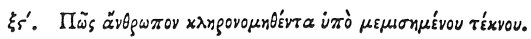

  
[Intangible Textual Heritage](../../index)  [Egypt](../index) 
[Index](index)  [Previous](hh138)  [Next](hh140) 

------------------------------------------------------------------------

[Buy this Book at
Amazon.com](https://www.amazon.com/exec/obidos/ASIN/1428631488/internetsacredte)

------------------------------------------------------------------------

*Hieroglyphics of Horapollo*, tr. Alexander Turner Cory, \[1840\], at
Intangible Textual Heritage

------------------------------------------------------------------------

### LXVI. HOW A MAN WHO HAS BEEN SUCCEEDED IN HIS PROPERTY BY A SON WHOM HE HATED.

 

When they would symbolise a *man who has been succeeded* 

p. 127

*in his property by a son whom he hated*, they depict AN APE WITH A
YOUNG APE BEHIND IT, For the ape begets two young apes, one of which he
loves extravagantly, and the other he hates: and the one which he loves
he keeps before him and kills with fondling; but the one which he hates
he keeps behind him and brings up.

------------------------------------------------------------------------

[Next: LXVII. How a Man That Conceals His Own Defects](hh140)
