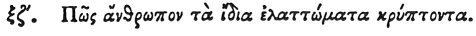

  
[Intangible Textual Heritage](../../index)  [Egypt](../index) 
[Index](index)  [Previous](hh139)  [Next](hh141) 

------------------------------------------------------------------------

[Buy this Book at
Amazon.com](https://www.amazon.com/exec/obidos/ASIN/1428631488/internetsacredte)

------------------------------------------------------------------------

*Hieroglyphics of Horapollo*, tr. Alexander Turner Cory, \[1840\], at
Intangible Textual Heritage

------------------------------------------------------------------------

### LXVII. HOW A MAN THAT CONCEALS HIS OWN DEFECTS.

 

When they would symbolise *a man that conceals his own defects*, they
depict AN APE [1](#fn_123) MAKING WATER; for
when he makes water he conceals his urine.

p. 128

------------------------------------------------------------------------

### Footnotes

[127:1](hh140.htm#fr_128) Pier. mentions a
reading, αἴλουρον "a cat."

------------------------------------------------------------------------

[Next: LXVIII. How One Who Hears With More Than Usual Acuteness](hh141)
