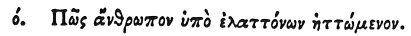

  
[Intangible Textual Heritage](../../index)  [Egypt](../index) 
[Index](index)  [Previous](hh142)  [Next](hh144) 

------------------------------------------------------------------------

[Buy this Book at
Amazon.com](https://www.amazon.com/exec/obidos/ASIN/1428631488/internetsacredte)

------------------------------------------------------------------------

*Hieroglyphics of Horapollo*, tr. Alexander Turner Cory, \[1840\], at
Intangible Textual Heritage

------------------------------------------------------------------------

p. 129

### LXIX. HOW A MAN OVERCOME BY HIS INFERIORS.

 

When they would symbolise *a man overcome by his inferiors*, they depict
TWO SKINS, one of an HYÆNA, [1](#fn_125) and
the other of a PANTHER; for if these two skins be placed together, the
panther's shoots its hair, but the other does not.

------------------------------------------------------------------------

### Footnotes

[129:1](hh143.htm#fr_130) Qy. A water skin.

------------------------------------------------------------------------

[Next: LXX. How a Man Who Overcomes His Private Enemy](hh144)
