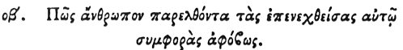

  
[Intangible Textual Heritage](../../index)  [Egypt](../index) 
[Index](index)  [Previous](hh144)  [Next](hh146) 

------------------------------------------------------------------------

[Buy this Book at
Amazon.com](https://www.amazon.com/exec/obidos/ASIN/1428631488/internetsacredte)

------------------------------------------------------------------------

*Hieroglyphics of Horapollo*, tr. Alexander Turner Cory, \[1840\], at
Intangible Textual Heritage

------------------------------------------------------------------------

### LXXII. HOW A MAN WHO PASSES FEARLESSLY THROUGH THE EVILS WHICH ASSAIL HIM.

 

When they would denote *a man who passes fearlessly through the evils
which assail him, even until death*, they delineate the SKIN OF AN
HYÆNA; [1](#fn_127) for if a man gird this skin
about himself, and pass

p. 131

through any of his enemies, he shall be injured by none of them, but
passes through fearlessly.

------------------------------------------------------------------------

### Footnotes

[130:1](hh145.htm#fr_132) The Arabs eat the
flesh of this animal to free themselves from some particular illness.

------------------------------------------------------------------------

[Next: LXXIII. How a Man Annoyed by his Private Enemies](hh146)
