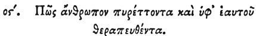

  
[Intangible Textual Heritage](../../index)  [Egypt](../index) 
[Index](index)  [Previous](hh148)  [Next](hh150) 

------------------------------------------------------------------------

[Buy this Book at
Amazon.com](https://www.amazon.com/exec/obidos/ASIN/1428631488/internetsacredte)

------------------------------------------------------------------------

*Hieroglyphics of Horapollo*, tr. Alexander Turner Cory, \[1840\], at
Intangible Textual Heritage

------------------------------------------------------------------------

### LXXVI. HOW A FEVERISH MAN WHO CURES HIMSELF.

 

When they would denote *a feverish man who cures himself*, they depict A
LION DEVOURING AN APE; for if, when in a fever, he devours an ape, he
recovers.

------------------------------------------------------------------------

[Next: LXXVII. How a Man who Becomes Steady at Last After his Former
Excesses](hh150)
