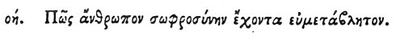

  
[Intangible Textual Heritage](../../index)  [Egypt](../index) 
[Index](index)  [Previous](hh150)  [Next](hh152) 

------------------------------------------------------------------------

[Buy this Book at
Amazon.com](https://www.amazon.com/exec/obidos/ASIN/1428631488/internetsacredte)

------------------------------------------------------------------------

*Hieroglyphics of Horapollo*, tr. Alexander Turner Cory, \[1840\], at
Intangible Textual Heritage

------------------------------------------------------------------------

### LXXVIII. HOW A MAN WHOSE TEMPERANCE IS EASILY CHANGED.

 

When they would symbolise *a man whose temperance is easily changed and
inconstant*, they depict a BULL WITH HIS RIGHT KNEE BOUND ROUND; for if
you bind him by a fetter on his right knee, you will find him
follow [1](#fn_131). And the bull is always
assumed as a symbol of temperance, because it never approaches the cow
after conception.

------------------------------------------------------------------------

### Footnotes

[134:1](hh151.htm#fr_136) Treb. from τοῦτον,
sic enim non coit, "for thus he holds no intercourse."

------------------------------------------------------------------------

[Next: LXXIX. How a Slayer of Sheep and Goats](hh152)
