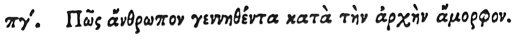

  
[Intangible Textual Heritage](../../index)  [Egypt](../index) 
[Index](index)  [Previous](hh155)  [Next](hh157) 

------------------------------------------------------------------------

[Buy this Book at
Amazon.com](https://www.amazon.com/exec/obidos/ASIN/1428631488/internetsacredte)

------------------------------------------------------------------------

*Hieroglyphics of Horapollo*, tr. Alexander Turner Cory, \[1840\], at
Intangible Textual Heritage

------------------------------------------------------------------------

p. 137

### LXXXIII. HOW A MAN WHO IS AT FIRST DEFORMED.

 

When they would symbolise *a man born deformed at first, but that has
afterwards acquired his proper shape*, they delineate a PREGNANT BEAR,
for it brings forth (a mass of) thick and condensed blood, which is
afterwards endued with life by being warmed between its thighs, and
perfected by being licked with its tongue.

------------------------------------------------------------------------

[Next: LXXXIV. How a Powerful Man, and One That Discerns What Things Are
Right](hh157)
