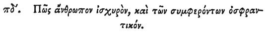

  
[Intangible Textual Heritage](../../index)  [Egypt](../index) 
[Index](index)  [Previous](hh156)  [Next](hh158) 

------------------------------------------------------------------------

[Buy this Book at
Amazon.com](https://www.amazon.com/exec/obidos/ASIN/1428631488/internetsacredte)

------------------------------------------------------------------------

*Hieroglyphics of Horapollo*, tr. Alexander Turner Cory, \[1840\], at
Intangible Textual Heritage

------------------------------------------------------------------------

### LXXXIV. HOW A POWERFUL MAN, AND ONE THAT DISCERNS WHAT THINGS ARE RIGHT.

 

When they would symbolise *a powerful man, and one that discerns what
things are right*, they depict an ELEPHANT

p. 138

\[paragraph continues\] WITH A TRUNK; for
with this he discerns by smelling, and overcomes all obstacles.

------------------------------------------------------------------------

[Next: LXXXV. How a King That Flees From Folly and Intemperance](hh158)
