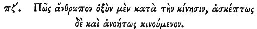

  
[Intangible Textual Heritage](../../index)  [Egypt](../index) 
[Index](index)  [Previous](hh159)  [Next](hh161) 

------------------------------------------------------------------------

[Buy this Book at
Amazon.com](https://www.amazon.com/exec/obidos/ASIN/1428631488/internetsacredte)

------------------------------------------------------------------------

*Hieroglyphics of Horapollo*, tr. Alexander Turner Cory, \[1840\], at
Intangible Textual Heritage

------------------------------------------------------------------------

### LXXXVII. HOW A MAN THAT IS QUICK IN HIS MOVEMENTS, BUT WHO MOVES IMPRUDENTLY AND INCONSIDERATELY.

 

When they would symbolise *a man that is quick in his movements, but who
moves without prudence and consideration*, they portray A STAG AND A
VIPER; for she flees at the sight of the viper.

------------------------------------------------------------------------

[Next: LXXXVIII. How a Man That is Providing His Own Tomb](hh161)
