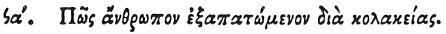

  
[Intangible Textual Heritage](../../index)  [Egypt](../index) 
[Index](index)  [Previous](hh163)  [Next](hh165) 

------------------------------------------------------------------------

[Buy this Book at
Amazon.com](https://www.amazon.com/exec/obidos/ASIN/1428631488/internetsacredte)

------------------------------------------------------------------------

*Hieroglyphics of Horapollo*, tr. Alexander Turner Cory, \[1840\], at
Intangible Textual Heritage

------------------------------------------------------------------------

### XCI. How A MAN DECEIVED BY FLATTERY.

 

When they would symbolise *a man deceived by flattery*, they represent A
STAG AND A MAN PLAYING ON A PIPE; for she is caught while

p. 142

listening to the sweet breathings of the singers as she stands entranced
in pleasure.

------------------------------------------------------------------------

[Next: XCII. How the Presage of a Plentiful Vintage](hh165)
