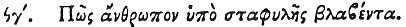

  
[Intangible Textual Heritage](../../index)  [Egypt](../index) 
[Index](index)  [Previous](hh165)  [Next](hh167) 

------------------------------------------------------------------------

[Buy this Book at
Amazon.com](https://www.amazon.com/exec/obidos/ASIN/1428631488/internetsacredte)

------------------------------------------------------------------------

*Hieroglyphics of Horapollo*, tr. Alexander Turner Cory, \[1840\], at
Intangible Textual Heritage

------------------------------------------------------------------------

### XCIII. HOW A MAN HAVING RECEIVED INJURY FROM THE GRAPE.

 

When they would symbolise *a man that is injured by the grape and cures
himself*, they depict a HOUPOO AND

p. 143

\[paragraph continues\] THE HERB ADIANTUM
(maidenhair); for when injured by the grape, if he places a piece of
adiantum in his mouth he is healed.

------------------------------------------------------------------------

[Next: XCIV. How a Man that Guards Himself from the Plots of His
Enemies](hh167)
