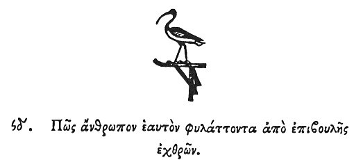

  
[Intangible Textual Heritage](../../index)  [Egypt](../index) 
[Index](index)  [Previous](hh166)  [Next](hh168) 

------------------------------------------------------------------------

[Buy this Book at
Amazon.com](https://www.amazon.com/exec/obidos/ASIN/1428631488/internetsacredte)

------------------------------------------------------------------------

*Hieroglyphics of Horapollo*, tr. Alexander Turner Cory, \[1840\], at
Intangible Textual Heritage

------------------------------------------------------------------------

### XCIV. HOW A MAN THAT GUARDS HIMSELF FROM THE PLOTS OF HIS ENEMIES.

  [1](#fn_134)

When they would symbolise *a man that guards himself from the plots of
his enemies*, they depict A CRANE ON THE WATCH; for these birds guard
themselves by watching in turns during the whole night.

------------------------------------------------------------------------

### Footnotes

[143:1](hh167.htm#fr_139)

*Thoth, who was always considered as a guardian of the land*.

------------------------------------------------------------------------

[Next: XCV. Quomodo Pædicationem](hh168)
