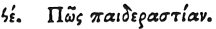

  
[Intangible Textual Heritage](../../index)  [Egypt](../index) 
[Index](index)  [Previous](hh167)  [Next](hh169) 

------------------------------------------------------------------------

[Buy this Book at
Amazon.com](https://www.amazon.com/exec/obidos/ASIN/1428631488/internetsacredte)

------------------------------------------------------------------------

*Hieroglyphics of Horapollo*, tr. Alexander Turner Cory, \[1840\], at
Intangible Textual Heritage

------------------------------------------------------------------------

p. 144

### XCV. QUOMODO PÆDICATIONEM.

 

Pædicationem designantes, geminas perdices pingunt: quæ cum viduæ sunt,
se invicem abutuntur.

------------------------------------------------------------------------

[Next: XCVI. How an Old Man Dying of Hunger](hh169)
