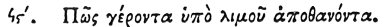

  
[Intangible Textual Heritage](../../index)  [Egypt](../index) 
[Index](index)  [Previous](hh168)  [Next](hh170) 

------------------------------------------------------------------------

[Buy this Book at
Amazon.com](https://www.amazon.com/exec/obidos/ASIN/1428631488/internetsacredte)

------------------------------------------------------------------------

*Hieroglyphics of Horapollo*, tr. Alexander Turner Cory, \[1840\], at
Intangible Textual Heritage

------------------------------------------------------------------------

### XCVI. HOW AN OLD MAN DYING OF HUNGER.

 

When they would symbolise *an old man dying of hunger*, they delineate
AN EAGLE WITH HIS BEAK EXTREMELY HOOKED; for as he grows old his beak
becomes extremely hooked, and he dies of hunger.

------------------------------------------------------------------------

[Next: XCVII. How a Man Living Perpetually in Motion, and Agitation of
Mind](hh170)
