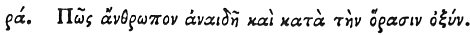

  
[Intangible Textual Heritage](../../index)  [Egypt](../index) 
[Index](index)  [Previous](hh173)  [Next](hh175) 

------------------------------------------------------------------------

[Buy this Book at
Amazon.com](https://www.amazon.com/exec/obidos/ASIN/1428631488/internetsacredte)

------------------------------------------------------------------------

*Hieroglyphics of Horapollo*, tr. Alexander Turner Cory, \[1840\], at
Intangible Textual Heritage

------------------------------------------------------------------------

### CI. HOW A MAN WHO IS IMPUDENT AND QUICK-SIGHTED.

 

When they would symbolise *a man who is impudent* 

p. 148

*and quicksighted*, they depict A FROG; for it has no blood except in
the eyes alone, and they call those who have blood in those parts
impudent: and hence the poet sings, "Drunkard with eyes of dog and heart
of stag."

------------------------------------------------------------------------

[Next: CII. How a Man Unable to Move Himself](hh175)
