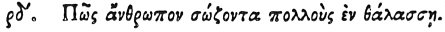

  
[Intangible Textual Heritage](../../index)  [Egypt](../index) 
[Index](index)  [Previous](hh176)  [Next](hh178) 

------------------------------------------------------------------------

[Buy this Book at
Amazon.com](https://www.amazon.com/exec/obidos/ASIN/1428631488/internetsacredte)

------------------------------------------------------------------------

*Hieroglyphics of Horapollo*, tr. Alexander Turner Cory, \[1840\], at
Intangible Textual Heritage

------------------------------------------------------------------------

### CIV. HOW A MAN WHO SAVES MANY IN THE SEA.

 

When they would symbolise *a man who saves many in the sea*, they depict
the TORPEDO FISH; for this, when it perceives a number of fishes unable
to swim, draws them to itself and preserves them.

------------------------------------------------------------------------

[Next: CV. How a Man that Wastefully Consumes Both Things that Are
Requisite and Things That Are Not](hh178)
