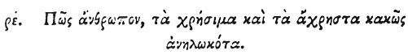

  
[Intangible Textual Heritage](../../index)  [Egypt](../index) 
[Index](index)  [Previous](hh177)  [Next](hh179) 

------------------------------------------------------------------------

[Buy this Book at
Amazon.com](https://www.amazon.com/exec/obidos/ASIN/1428631488/internetsacredte)

------------------------------------------------------------------------

*Hieroglyphics of Horapollo*, tr. Alexander Turner Cory, \[1840\], at
Intangible Textual Heritage

------------------------------------------------------------------------

p. 150

### CV. HOW A MAN THAT WASTEFULLY CONSUMES BOTH THINGS THAT ARE REQUISITE AND THINGS THAT ARE NOT.

 

When they would symbolise *a man that wastefully consumes both things
that are requisite and useless*, they delineate a POLYPUS; for after
eating much and extravagantly, it lays by food in its holes, and when it
has consumed that which is useful, it then throws away that which is
useless.

------------------------------------------------------------------------

[Next: CVI. How a Man the Ruler of his Tribe](hh179)
