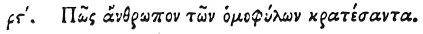

  
[Intangible Textual Heritage](../../index)  [Egypt](../index) 
[Index](index)  [Previous](hh178)  [Next](hh180) 

------------------------------------------------------------------------

[Buy this Book at
Amazon.com](https://www.amazon.com/exec/obidos/ASIN/1428631488/internetsacredte)

------------------------------------------------------------------------

*Hieroglyphics of Horapollo*, tr. Alexander Turner Cory, \[1840\], at
Intangible Textual Heritage

------------------------------------------------------------------------

### CVI. HOW A MAN THE RULER OF HIS TRIBE.

 

When they would symbolise *a man the ruler of his* 

p. 151

*tribe*, they depict A CRAYFISH AND A POLYPUS; for he rules over the
polypi, and holds the chief place among them.

------------------------------------------------------------------------

[Next: CVII. How a Man who is Married to a Woman](hh180)
