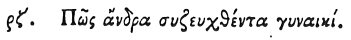

  
[Intangible Textual Heritage](../../index)  [Egypt](../index) 
[Index](index)  [Previous](hh179)  [Next](hh181) 

------------------------------------------------------------------------

[Buy this Book at
Amazon.com](https://www.amazon.com/exec/obidos/ASIN/1428631488/internetsacredte)

------------------------------------------------------------------------

*Hieroglyphics of Horapollo*, tr. Alexander Turner Cory, \[1840\], at
Intangible Textual Heritage

------------------------------------------------------------------------

### CVII. HOW A MAN WHO IS MARRIED TO A WOMAN.

 

When they would symbolise *a man who is married to a woman from their
very infancy wherein they were born*, they depict PREGNANT PINNÆ; for
these when produced within the shell, after a short time are joined with
one another, even within the shell.

------------------------------------------------------------------------

[Next: CVIII. How a Man that Does Not Provide For Himself](hh181)
