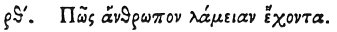

  
[Intangible Textual Heritage](../../index)  [Egypt](../index) 
[Index](index)  [Previous](hh181)  [Next](hh183) 

------------------------------------------------------------------------

[Buy this Book at
Amazon.com](https://www.amazon.com/exec/obidos/ASIN/1428631488/internetsacredte)

------------------------------------------------------------------------

*Hieroglyphics of Horapollo*, tr. Alexander Turner Cory, \[1840\], at
Intangible Textual Heritage

------------------------------------------------------------------------

### CIX. HOW A MAN ADDICTED TO GLUTTONY.

 

When they would symbolise *a man addicted to gluttony*, they delineate A
CHARFISH;

p. 153

for this is the only fish which ruminates, and eats all the little
fishes which fall in its way.

------------------------------------------------------------------------

[Next: CX. How a Man that Vomits Up His Food](hh183)
