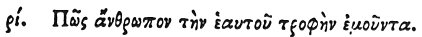

  
[Intangible Textual Heritage](../../index)  [Egypt](../index) 
[Index](index)  [Previous](hh182)  [Next](hh184) 

------------------------------------------------------------------------

[Buy this Book at
Amazon.com](https://www.amazon.com/exec/obidos/ASIN/1428631488/internetsacredte)

------------------------------------------------------------------------

*Hieroglyphics of Horapollo*, tr. Alexander Turner Cory, \[1840\], at
Intangible Textual Heritage

------------------------------------------------------------------------

### CX. HOW A MAN THAT VOMITS UP HIS FOOD.

 

When they would symbolise *a man that vomits up his food, and again eats
insatiably*, they depict a SEAWEASEL; for it brings forth through its
mouth, and drinks in the seed whilst swimming.

------------------------------------------------------------------------

[Next: CXI. How a Man That Has Commerce With Persons of Another
Tribe](hh184)
