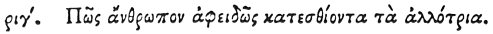

  
[Intangible Textual Heritage](../../index)  [Egypt](../index) 
[Index](index)  [Previous](hh185)  [Next](hh187) 

------------------------------------------------------------------------

[Buy this Book at
Amazon.com](https://www.amazon.com/exec/obidos/ASIN/1428631488/internetsacredte)

------------------------------------------------------------------------

*Hieroglyphics of Horapollo*, tr. Alexander Turner Cory, \[1840\], at
Intangible Textual Heritage

------------------------------------------------------------------------

### CXIII. HOW A MAN THAT EATS UNSPARINGLY OF ANOTHER'S SUBSTANCE.

 

When they would symbolise *a man that eats unsparingly *

p. 155

*of another's substance, and afterwards consumes his own*, they depict a
POLYPUS; for, if he be in want of food from other things, he eats his
own feelers.

------------------------------------------------------------------------

[Next: CXIV. How a Man That is Eager After Good](hh187)
