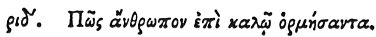

  
[Intangible Textual Heritage](../../index)  [Egypt](../index) 
[Index](index)  [Previous](hh186)  [Next](hh188) 

------------------------------------------------------------------------

[Buy this Book at
Amazon.com](https://www.amazon.com/exec/obidos/ASIN/1428631488/internetsacredte)

------------------------------------------------------------------------

*Hieroglyphics of Horapollo*, tr. Alexander Turner Cory, \[1840\], at
Intangible Textual Heritage

------------------------------------------------------------------------

### CXIV. HOW A MAN THAT IS EAGER AFTER GOOD.

 

When they would symbolise *a man that is eager for good, and who instead
of it falls into evil*, they portray a CUTTLEFISH; for this fish if it
see any other longing to catch it, ejects a black liquid from its belly
into the water, so that by these means it is no longer visible, and thus
escapes.

------------------------------------------------------------------------

[Next: CXV. How a Prolific Man](hh188)
