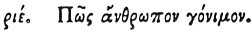

  
[Intangible Textual Heritage](../../index)  [Egypt](../index) 
[Index](index)  [Previous](hh187)  [Next](hh189) 

------------------------------------------------------------------------

[Buy this Book at
Amazon.com](https://www.amazon.com/exec/obidos/ASIN/1428631488/internetsacredte)

------------------------------------------------------------------------

*Hieroglyphics of Horapollo*, tr. Alexander Turner Cory, \[1840\], at
Intangible Textual Heritage

------------------------------------------------------------------------

p. 156

### CXV. HOW A PROLIFIC MAN.

 

When they would symbolise *a prolific man*, they depict the
HOUSE-SPARROW; hic enim immodicâ irâ et copiâ seminis ductus septies in
horâ fœminam init copiosum semen effutiens.

------------------------------------------------------------------------

[Next: CXVI. How a Man That is Constant, and Uniformly Tempered](hh189)
