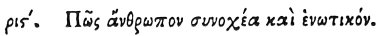

  
[Intangible Textual Heritage](../../index)  [Egypt](../index) 
[Index](index)  [Previous](hh188)  [Next](hh190) 

------------------------------------------------------------------------

[Buy this Book at
Amazon.com](https://www.amazon.com/exec/obidos/ASIN/1428631488/internetsacredte)

------------------------------------------------------------------------

*Hieroglyphics of Horapollo*, tr. Alexander Turner Cory, \[1840\], at
Intangible Textual Heritage

------------------------------------------------------------------------

### CXVI. HOW A MAN THAT IS CONSTANT, AND UNIFORMLY TEMPERED.

 

When they would symbolise *a man that is constant, and uniformly
tempered*, they depict a LYRE; for it preserves the continuity of its
notes.

------------------------------------------------------------------------

[Next: CXVII. How a Man Previously Deranged in His Intellects, but
Afterwards Becoming Sane](hh190)
