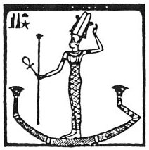

  
[Intangible Textual Heritage](../../index)  [Egypt](../index) 

------------------------------------------------------------------------

[Buy this Book at
Amazon.com](https://www.amazon.com/exec/obidos/ASIN/1428631488/internetsacredte)

------------------------------------------------------------------------

<table width="75%">
<colgroup>
<col style="width: 50%" />
<col style="width: 50%" />
</colgroup>
<tbody>
<tr class="odd">
<td width="50%" data-valign="TOP"></td>
<td width="50%" data-valign="CENTER"><h1 id="the-hieroglyphics-of-horapollo-nilous" data-align="CENTER">The Hieroglyphics of Horapollo Nilous</h1>
<h2 id="translated-by-alexander-turner-cory" data-align="CENTER">translated by Alexander Turner Cory</h2>
<h4 id="section" data-align="CENTER">[1840]</h4></td>
</tr>
</tbody>
</table>

------------------------------------------------------------------------

[Contents](#contents)    [Start Reading](hh000)

------------------------------------------------------------------------

|                                                                                                                           |
|---------------------------------------------------------------------------------------------------------------------------|
|  |

Horapollo, the traditional author of this work, was one of the last
priests of the Ancient Egyptian religion in the fifth century C.E. His
only extant work is this, the Hieroglyphica, which claims to be an
explanation of the Egyptian Hieroglyphs, mixed with a great deal of
ancient, and often wrong, natural history. It was translated two
centuries later into Greek. The text was rediscovered in 1422, and it
was first put into print in 1505.

By the time that Egyptian was finally deciphered in the 19th century,
the Hieroglphics of Horapollo fell out of favor. A few of the examples
in the beginning of the book turned out to be correct, or close to
correct. What makes this book of continued interest is that it can be
read in a number of ways: a glimpse into an archaic mindset, a mystical
inventory of the universe, or a series of surreal images.

Production Notes: I had to omit the parallel Greek text which appears in
the original book. For this reason, I also omitted any footnotes which
only pertained to the Greek, not to the English translation. Portions of
this book were in Latin. These parts are transcribed verbatim, with no
attempt to translate them.

------------------------------------------------------------------------

 [Title Page](hh000)  
[Preface](hh001)  

### The Hieroglyphics of Horapollo Nilous

[Title Page and Front Matter](hh002)  

### Book I

[I. How They Denote Eternity](hh003)  
[II. How the Universe](hh004)  
[III. How A Year](hh005)  
[IV. How A Month](hh006)  
[V. How the Current or Civil Year](hh007)  
[VI. What They Signify by Delineating a Hawk](hh008)  
[VII. How They Indicate the Soul](hh009)  
[VIII. How Ares and Aphrodite (Hor and Hathor)](hh010)  
[IX. How Marriage](hh011)  
[X. How an Only Begotten](hh012)  
[XI. What They Imply by Depicting a Vulture](hh013)  
[XII. How They Denote Hephæstus \[Phthah\]](hh014)  
[XIII. What They Intimate When They Depict a Star](hh015)  
[XIV. What They Denote When They Pourtray A Cynocephalus](hh016)  
[XV. How They Denote the Renovation of the Moon](hh017)  
[XVI. How the Two Equinoxes](hh018)  
[XVII. How They Denote Intrepidity](hh019)  
[XVIII. How They Denote Strength](hh020)  
[XIX. How They Denote a Watchful Person](hh021)  
[XX. How the Terrible](hh022)  
[XXI. How the Rising of the Nile](hh023)  
[XXII. How They Designate Egypt](hh024)  
[XXIII. How a Man That Has Not Travelled Abroad](hh025)  
[XXIV. How an Amulet \[Protection\]](hh026)  
[XXV. How They Denote an Imperfect Man](hh027)  
[XXVI. How an Opening](hh028)  
[XXVII. How Speech](hh029)  
[XXVIII. How Dumbness](hh030)  
[XXIX. How a Voice From a Distance](hh031)  
[XXX. How Ancient Descent](hh032)  
[XXXI. How Taste](hh033)  
[XXXII. How Delight](hh034)  
[XXXIII. How Sexual Intercourse](hh035)  
[XXXIV. How a Soul Continuing a Long Time Here](hh036)  
[XXXV. How a Man Returning Home After a Long Time From a Foreign
Land](hh037)  
[XXXVI. How They Denote the Heart](hh038)  
[XXXVII. How Education](hh039)  
[XXXVIII. How the Egyptian Letters](hh040)  
[XXXIX. How a Sacred Scribe](hh041)  
[XL. In What Manner They Represent Government, or a Judge](hh042)  
[XLI. How They Signify the Bearer of the Shrine](hh043)  
[XLII. How They Represent an Horoscopus \[Observer of the
Hours.\]](hh044)  
[XLIII. How They Denote Purity](hh045)  
[XLIV. How They Intimate a Thing Unlawful, or an Abomination](hh046)  
[XLV. How They Represent the Mouth](hh047)  
[XLVI. How Manliness Combined with Temperance](hh048)  
[XLVII. How Hearing](hh049)  
[XLVIII. How the Member of a Prolific Man](hh050)  
[XLIX. How They Denote Impurity](hh051)  
[L. How a Disappearance](hh052)  
[LI. How Impudence](hh053)  
[LII. How They Represent Knowledge](hh054)  
[LIII. How They Represent a Son](hh055)  
[LIV. How a Fool](hh056)  
[LV. How They Represent Gratitude](hh057)  
[LVI. How an Unjust and Ungrateful Man](hh058)  
[LVII. How One Who is Ungrateful to His Benefactors](hh059)  
[LVIII. How an Impossibility](hh060)  
[LIX. How a Very Bad King](hh061)  
[LX. How a Vigilant King](hh062)  
[LXI. How They Designate a Ruler of the World](hh063)  
[LXII. How a People Obedient to Their King](hh064)  
[LXIII. How a King Who Governs a Part of the World](hh065)  
[LXIV. How One Who Governs All Things](hh066)  
[LXV. How a Fuller](hh067)  
[LXVI. How a Month](hh068)  
[LXVII. How a Rapacious, or Prolific, or Furious Man](hh069)  
[LXVIII. How Sunrise](hh070)  
[LXIX. How Sunset](hh071)  
[LXX. How They Shadow Forth Darkness](hh072)  

### Book II.

[Introduction](hh073)  
[I. What They Signify By Depicting A Star](hh074)  
[II. What by an Eaglet](hh075)  
[III. What by Two Feet Conjoined and Advancing](hh076)  
[IV. What by the Heart of a Man Suspended by the Windpipe](hh077)  
[V. How They Denote the Front of Battle](hh078)  
[VI. What by a Finger](hh079)  
[VII. Quid Penis Manu Compressa](hh080)  
[VIII. How They Denote Disease](hh081)  
[IX. How the Loins of a Man](hh082)  
[X. How They Symbolize Permanency and Safety](hh083)  
[XI. How Concord](hh084)  
[XII. How a Crowd](hh085)  
[XIII. How Admeasurement](hh086)  
[XIV. How a Woman Pregnant](hh087)  
[XV. How Wind](hh088)  
[XVI. How Fire](hh089)  
[XVII. How a Work](hh090)  
[XVIII. How Punishment](hh091)  
[XIX. How Impiety](hh092)  
[XX. How an Hour \[Execration?\]](hh093)  
[XXI. How Anything of Long Duration](hh094)  
[XXII. How Aversion](hh095)  
[XXIII. How a Future Act](hh096)  
[XXIV. How a Murderer, or the Blood of a Crocodile](hh097)  
[XXV. How Death](hh098)  
[XVI. How Love](hh099)  
[XXVII. How the Most Ancient](hh100)  
[XXVIII. How a Siege](hh101)  
[XXIX. How Infinite, or a Song, or Fate](hh102)  
[XXX. What One Line Bent Over Another Signifies](hh103)  
[XXXI. What They Denote by Depicting a Swallow](hh104)  
[XXXII. What by a Black Dove](hh105)  
[XXXIII. What by an Ichneumon](hh106)  
[XXXIV. What They Denote by Engraving Origanum (Wild Marjoram) for a
Hieroglyphic](hh107)  
[XXXV. What by a Scorpion and Crocodile](hh108)  
[XXXVI. What by a Weasel](hh109)  
[XXXVII. What by a Hog](hh110)  
[XXXVIII. How Immoderate Anger](hh111)  
[XXXIX. How an Old Minstrel](hh112)  
[XL. How They Denote a Man Who Lives with his Wife](hh113)  
[XLI. What They Intimate by Pourtraying a Blind Beetle](hh114)  
[XLII. What They Design by Depicting a Mule](hh115)  
[XLIII. How They Denote a Woman who has Brought Forth Female
Infants](hh116)  
[XLIV. How They Denote Wasps](hh117)  
[XLV. How A Woman Who Miscarries](hh118)  
[XLVI. How a Man Who Cures Himself by an Oracle](hh119)  
[XLVII. How a Swarm of Gnats](hh120)  
[XLVIII. How a Man That Has No Bile, But Receives It From
Another](hh121)  
[XLIX. How a Man Who Dwells Securely in a City](hh122)  
[L. How a Man Who is Weak and Persecuted by Another](hh123)  
[LI. How They Denote A Man Who Flees For Refuge to his Patron, and
Receives No Assistance](hh124)  
[LII. How They Represent a Weak Man That is Audacious](hh125)  
[LIII. How a Woman Suckling and Bringing Up Her Children Well](hh126)  
[LIV. How a Man Fond of Dancing](hh127)  
[LV. How a Mystic Man](hh128)  
[LVI. How a King who Keeps Himself Apart, and Shews No Mercy to
Delinquencies](hh129)  
[LVII. How the Great Cyclical Renovation](hh130)  
[LVIII. How One Who is Fond of His Father](hh131)  
[LIX. How a Woman That Hates Her Husband](hh132)  
[LX. How They Denote Children Plotting Against Their Mothers](hh133)  
[LXI. How They Denote a Man Who Sickens Under the Reproach of
Accusation](hh134)  
[LXII. How a Man that is Burnt with Fire](hh135)  
[LXIII. How a Blind Man](hh136)  
[LXIV. How a Man That Never Stirs Out](hh137)  
[LXV. How a Man who is Injured by Self-Inflictions](hh138)  
[LXVI. How a Man Who Has Been Succeeded in His Property by a Son Whom He
Hated](hh139)  
[LXVII. How a Man That Conceals His Own Defects](hh140)  
[LXVIII. How One Who Hears With More Than Usual Acuteness](hh141)  
[LXIX. How an Unsettled Person](hh142)  
[LXIX. How a Man Overcome by his Inferiors](hh143)  
[LXX. How a Man Who Overcomes His Private Enemy](hh144)  
[LXXII. How a Man Who Passes Fearlessly Through the Evils Which Assail
Him](hh145)  
[LXXIII. How a Man Annoyed by his Private Enemies](hh146)  
[LXXIV. How a Man Who is Fearful Lest Accidents Should Happen
Unexpectedly to Himself](hh147)  
[LXXV. How a Man Calmed by Fire During Anger](hh148)  
[LXXVI. How a Feverish Man Who Cures Himself](hh149)  
[LXXVII. How a Man who Becomes Steady at Last After his Former
Excesses](hh150)  
[LXXVIII. How a Man Whose Temperance is Easily Changed](hh151)  
[LXXIX. How a Slayer of Sheep and Goats](hh152)  
[LXXX. How They Denote a Man Eating](hh153)  
[LXXXI. How They Denote a Rapacious and Inactive Man](hh154)  
[LXXXII. How a Woman That Has Brought Forth Once](hh155)  
[LXXXIII. How a Man Who is at First Deformed](hh156)  
[LXXXIV. How a Powerful Man, and One That Discerns What Things Are
Right](hh157)  
[LXXXV. How a King That Flees From Folly and Intemperance](hh158)  
[LXXXVI. How a King that Flees from a Trifler](hh159)  
[LXXXVII. How a Man That is Quick in his Movements, But Who Moves
Imprudently and Inconsiderately](hh160)  
[LXXXVIII. How a Man That is Providing His Own Tomb](hh161)  
[LXXXIX. How a Man that has Lived to a Proper Age](hh162)  
[XC. How a Man who Conceals his Depravity within Himself](hh163)  
[XCI. How a Man Deceived by Flattery](hh164)  
[XCII. How the Presage of a Plentiful Vintage](hh165)  
[XCIII. How a Man Having Received Injury from the Grape](hh166)  
[XCIV. How a Man that Guards Himself from the Plots of His
Enemies](hh167)  
[XCV. Quomodo Pædicationem](hh168)  
[XCVI. How an Old Man Dying of Hunger](hh169)  
[XCVII. How a Man Living Perpetually in Motion, and Agitation of
Mind](hh170)  
[XCVIII. How a Man Skilled in Celestial Matters](hh171)  
[XCIX. How a Man Who Through Want Dismisses His Own Children](hh172)  
[C. How a Man Who is Tardy in Moving With His Feet](hh173)  
[CI. How a Man Who is Impudent and Quick-Sighted](hh174)  
[CII. How a Man Unable to Move Himself](hh175)  
[CIII. How a Man Hostile to All](hh176)  
[CIV. How a Man Who Saves Many in the Sea](hh177)  
[CV. How a Man that Wastefully Consumes Both Things that Are Requisite
and Things That Are Not](hh178)  
[CVI. How a Man the Ruler of his Tribe](hh179)  
[CVII. How a Man who is Married to a Woman](hh180)  
[CVIII. How a Man that Does Not Provide For Himself](hh181)  
[CIX. How a Man Addicted to Gluttony](hh182)  
[CX. How a Man that Vomits Up His Food](hh183)  
[CXI. How a Man That Has Commerce With Persons of Another
Tribe](hh184)  
[CXII. How a Man Punished for Murder](hh185)  
[CXIII. How a Man that Eats Unsparingly of Another's Substance](hh186)  
[CXIV. How a Man That is Eager After Good](hh187)  
[CXV. How a Prolific Man](hh188)  
[CXVI. How a Man That is Constant, and Uniformly Tempered](hh189)  
[CXVII. How a Man Previously Deranged in His Intellects, but Afterwards
Becoming Sane](hh190)  
[CXVIII. How a Man Who Distributes Justice Impartially to All](hh191)  
[CXIX. How a Man That is Fond of Building](hh192)  
[Appendix](hh193)  
[Index of the Abbreviations Used](hh194)  
