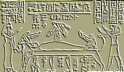

  
[Intangible Textual Heritage](../../index)  [Egypt](../index) 

------------------------------------------------------------------------

<table width="75%">
<colgroup>
<col style="width: 50%" />
<col style="width: 50%" />
</colgroup>
<tbody>
<tr class="odd">
<td width="50%"></td>
<td width="50%"><h1 id="legends-of-the-gods" data-align="CENTER">Legends of the Gods</h1>
<h5 id="the-egyptian-texts-edited-with-translations" data-align="CENTER">The Egyptian Texts, edited with Translations</h5>
<h2 id="by-e.-a.-wallis-budge" data-align="CENTER">by E. A. Wallis Budge</h2>
<h4 id="section" data-align="CENTER">[1912]</h4></td>
</tr>
</tbody>
</table>

------------------------------------------------------------------------

[Title Page](leg00)  
[Preface](leg01)  
[Contents](leg02)  
[List of Plates and Illustrations](leg03)  

### Introduction

[Summary: I. The Legend of the God Neb-er-tcher, and the History of
Creation](leg04)  
[Summary: II. The Legend of the Destruction of Mankind](leg05)  
[Summary: III. The Legend Of Ra and Isis.](leg06)  
[Summary: IV: The Legend of Heru-Behutet and the Winged Disk](leg07)  
[Summary: V. Legend of the Birth of Horus, Son of Isis and
Osiris.](leg08)  
[Summary: VI. A Legend of Khensu Nefer-hetep and the Princess of
Bekhten](leg09)  
[Summary: VII. A Legend Of Khnemu And Of A Seven Years' Famine](leg10)  
[Summary: VIII. The Legend of the Death and Resurrection of Horus, and
Other Magical Texts](leg11)  
[Summary: IX: The History of Isis and Osiris](leg12)  

### Legends of Egyptian Gods

[The History Of Creation--A.](leg13)  
[The History of Creation--B.](leg14)  
[The Legend of the Destruction of Mankind, Chapter I.](leg15)  
[The Legend of the Destruction of Mankind, Chapter II.](leg16)  
[The Legend Of The Destruction Of Mankind, Chapter III.](leg17)  
[The Legend Of The Destruction Of Mankind, Chapter IV.](leg18)  
[The Legend Of The Destruction Of Mankind, Chapter V.](leg19)  
[The Legend Of Ra And Isis.](leg20)  
[The Legend Of Horus Of Behutet And The Winged Disk.](leg21)  
[A Hymn To Osiris And A Legend Of The Origin Of Horus.](leg22)  
[A Legend of Ptah Nefer-Hetep and the Princess of Bekhten](leg23)  
[A Legend of the God Khnemu and of a Seven Years' Famine](leg24)  

### The Legend of the Death of Horus

[I.--Incantations Against Reptiles and Noxious Creatures In
General](leg25)  
[The Chapter of Casting a Spell on the Cat](leg26)  
[Another Chapter](leg27)  
[II.--The Narrative of Isis](leg28)  

### The History of Isis and Osiris

[Section I](leg29)  
[Section II](leg30)  
[Section III](leg31)  
[Section IV](leg32)  
[Section V](leg33)  
[Section VI](leg34)  
[Section VII.](leg35)  
[Section VIII.](leg36)  
[Section IX](leg37)  
[Section X](leg38)  
[Section XI.](leg39)  
[Section XII.](leg40)  
[Section XIII.](leg41)  
[Section XIV.](leg42)  
[Section XV.](leg43)  
[Section XVI.](leg44)  
[Section XVII.](leg45)  
[Section XVIII.](leg46)  
[Section XIX.](leg47)  
[Section XX.](leg48)  
[Section XXI.](leg49)  
[Section XXII. First Explanation of the Story](leg50)  
[Section XXIII](leg51)  
[Section XXIV](leg52)  
[Section XXV: Second Explanation of the Story](leg53)  
[Section XXVI](leg54)  
[Section XXVII](leg55)  
[Section XXX](leg56)  
[Section XXXI](leg57)  
[Section XXXII: Third Explanation of the Story](leg58)  
[Sections XXXIII and XXXIV](leg59)  
[Section XXXVI](leg60)  
[Section XXXVIII](leg61)  
[Section XXXIX](leg62)  
[Section XL](leg63)  
[Section XLI and XLII: Fourth Explanation of the Story](leg64)  
[Section XLIII](leg65)  
[Section XLIV, etc.: Fifth Explanation of the Story](leg66)  
