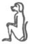

  
[Intangible Textual Heritage](../../index)  [Egypt](../index) 
[Index](index)  [Previous](leg38)  [Next](leg40) 

------------------------------------------------------------------------

p. 214

XI\. When you hear, therefore, the mythological tales which the
Egyptians tell of their gods, their wanderings, their mutilations, and
many other disasters which befell them, remember what has just been
said, and be assured that nothing of what is thus told you is really
true, or ever happened in fact. For can it be imagined that it is the
dog [1](#fn_289) itself which is reverenced by
them under the name of Hermes [2](#fn_290)? It
is the qualities of this animal, his constant vigilance, and his acumen
in distinguishing his friends from his foes, which have rendered him, as
Plato says, a meet emblem of that god who is the chief patron of
intelligence. Nor can we imagine that they think that the sun, like a
newly born babe, springs up every day out of a lily. It is quite true
that they represent the rising sun in this manner, [3](#fn_291) but the reason is because they wish to
indicate thereby that it is moisture to which we owe the first kindling
of this luminary. In like manner, the cruel and bloody king of Persia,
Ochus, who not only put to death great numbers of the people, but even
slew the Apis Bull himself, and afterwards served him up in a banquet to
his friends, is represented by them by a

p. 215

sword, and by this name he is still to be found in the catalogue of
their kings. This name, therefore, does not represent his person, but
indicates his base and cruel qualities, which were best suggested by the
picture of an instrument of destruction. If, therefore, O Clea, you will
hear and entertain the story of these gods from those who know how to
explain it consistently with religion and philosophy, if you will
steadily persist in the observance of all these holy rites which the
laws require of you, and are moreover fully persuaded that to form true
notions of the divine nature is more acceptable to them than any
sacrifice or mere external act of worship can be, you will by this means
be entirely exempt from any danger of falling into superstition, an evil
no less to be avoided than atheism itself.

------------------------------------------------------------------------

### Footnotes

[214:1](leg39.htm#fr_291) The animal here
referred to must be the dog-headed ape, 
, which we see in pictures of the Judgment assisting
Thoth to weigh the heart of the dead. This dog-headed ape is a
wonderfully intelligent creature, and its weird cleverness is
astonishing.

[214:2](leg39.htm#fr_292) The Egyptian Tehuti,
or Thoth.

[214:3](leg39.htm#fr_293)  .

------------------------------------------------------------------------

[Next: Section XII.](leg40)
