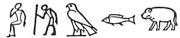

  
[Intangible Textual Heritage](../../index)  [Egypt](../index) 
[Index](index)  [Previous](leg58)  [Next](leg60) 

------------------------------------------------------------------------

\[§§ XXXIII., XXXIV. Some of the more philosophical priests assert that
Osiris does not symbolize the Nile only, nor Typhon the sea only, but
that Osiris represents the principle and power of moisture in general,
and that Typhon represents everything which is scorching, burning, and
fiery, and whatever destroys moisture. Osiris they believe to have been
of a black [2](#fn_329) colour, because water
gives a black 2 tinge to everything with which it is mixed. The Mnevis
Bull [3](#fn_330) kept at Heliopolis is, like
Osiris, black in colour, "and even Egypt [4](#fn_331) itself, by reason of the

p. 242

extreme blackness of the soil, is called by them 'Chemia,' the very name
which is given to the black part or pupil of the eye. [1](leg60.htm#fn_332) It is, moreover, represented by
them under the figure of a human heart." The Sun and Moon are not
represented as being drawn about in chariots, but as sailing round the
world in ships, which shows that they owe their motion, support, and
nourishment to the power of humidity. [2](leg60.htm#fn_333) Homer and Thales both learned
from Egypt that "water was the first principle of all things, and the
cause of generation." [3](leg60.htm#fn_334)\]

------------------------------------------------------------------------

### Footnotes

[241:1](leg58.htm#fr_330) Each of these signs,
 , except the last, does
mean what Plutarch says it means, but his method of reading them
together is wrong, and it proves that he did not understand that
hieroglyphics were used alphabetically as well as ideographically.

[241:2](leg59.htm#fr_331) Experiments recently
conducted by Lord Rayleigh indicate that the true colour of water is
blue.

[241:3](leg59.htm#fr_332) In Egyptian, Nem-ur,
or Men-ur, and he was "called the life of Ra."

[241:4](leg59.htm#fr_333) The commonest name of
Egypt is KEMT, "black land," as opposed to the reddish-yellow sandy
deserts on each side of the "valley of black mud." The word for "black"
is *kam*.

------------------------------------------------------------------------

[Next: Section XXXVI](leg60)
