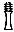

  
[Intangible Textual Heritage](../../index)  [Egypt](../index) 
[Index](index)  [Previous](lfo006)  [Next](lfo008) 

------------------------------------------------------------------------

### THE SECOND CEREMONY.

The ceremony of the sprinkling of water having been completed, the
second ceremony begins. The SEM priest, or one of his assistants, took
in his hand a censer in which incense has been placed, and having set
fire in it, and made the incense to burn, he walked with it four times
round the statue or mummy, and censed it, whilst the Kher heb recited
the following four times:--

"Let him that advanceth advance with his KA.

"Horus advanceth with his KA.

"Set advanceth with his KA.

"Thoth advanceth with his KA.

"Sep advanceth with his KA.

"Osiris advanceth with his KA.

"Khenti-maati [1](#fn_53) advanceth with his KA.

p. 48

"Thy Tet shall advance with thy KA.

"Hail, Unas! The arm of thy KA is before thee.

"Hail, Unas! The arm of thy KA is behind thee.

"Hail, Unas! The leg of thy KA is before thee.

"Hail, Unas! The leg of thy KA is behind thee.

"O Osiris Unas! I have given unto thee the Eye

 

   
The Sem priest carrying the censer of burning incense.

 

of Horus, and thy face is filled therewith, and the perfume of the Eye
of Horus is to thee."

This formula begins with an address to the statue, or mummy, which is
bidden to advance, just as do Horus, Set, Thoth, Sep, Osiris, and
Khenti-maati, i.e., the dweller without eyes (the Horus of the dark
night when neither sun nor moon is visible), These gods are

p. 49

not separated from their KAU, and the KA of Unas, as the equal of their
KAU, shall be with him. With his KA, however, shall come his *Tchet*, or
*Tet*,  , or  , i.e., his backbone, or pillar
which supports the backbone. The 
, as Prof. Maspero has shown, represents the
tree-trunk which was worshipped at Mendes in connection with Osiris; it
was animated by Osiris, and was all-powerful in supporting the dead
because of the presence of the god in it. Under the Middle and New
Empires the   is often
seen painted on the bottoms of the insides of coffins, and when coffins
were intended to stand on their feet, the 
 was generally painted on the back outside. Thus when
lying down the mummy rested on his 
 and when standing up was supported by it. The KA of
the deceased comes with him because it is supported by Osiris, and it
comes with one leg and one arm before him, and one leg and one arm
behind him. The exact signification of these expressions is unknown, but
about the translation of the words there is no doubt.

We next see that the incense with which the mummy is censed represents
the Eye of Horus, or the Sun, and the use of the expression dates from
the time when Horus was the greatest of the gods of heaven, and the sun
was regarded as his eye. The sun was, of course, the source of heat and
light, and therefore of all

p. 50

life, and "Eye of Horus" was a synonym for everything which was
beneficial for the living and the dead. The hot fumes of the incense
surrounded the mummy or statue and gave warmth to it, the smoke rose up
before its face, which it covered with a sort of layer, and the general
effect of the ceremony was to make the deceased pure and warm. The first
ceremony removed sin from the new dwelling-place of the KA, and the
second continued its purification, and gave to it the quickening beat
which was derived from the Eye of Horus. The pungent smell of the
incense formed a sort of atmosphere for the dead, and was pleasant to
them.

------------------------------------------------------------------------

### Footnotes

[47:1](lfo007.htm#fr_53) Dümichen, "the dweller
in the town of Sekhem (Letopolis)."

------------------------------------------------------------------------

[Next: The Third Ceremony](lfo008)
