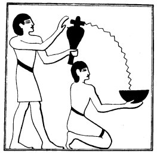

  
[Intangible Textual Heritage](../../index)  [Egypt](../index) 
[Index](index)  [Previous](lfo007)  [Next](lfo009) 

------------------------------------------------------------------------

### THE THIRD CEREMONY.

The third ceremony of purification was performed by means of water, in
which two different kinds of incense had been dissolved. The rubric in
the text of Unas mentions "two balls" of incense, but that of the text
of Peta-Amen-apt says that one ball shall be of incense of Shet pet,
i.e., of the incense prepared from the salt found in the Natron Valley,
and the other of the salt which is found near the city of Nekheb, or
Eileithyiapolis. Shut pet was a portion of the Sekhet-Hemam, or "Field
of Salt," known to-day as the "Wadi an-Natrun," which lies about
forty-five miles to the northwest of Cairo, and the incense made from
the salt deposits here was called "Incense of the North." The incense
made from the salt deposits near Nekheb was

p. 51

called "Incense of the South." The KA whose statue had been purified by
incense from each place was free to journey through the North and South
of Egypt, and in a sense it made him "lord of the Two Lands," i.e., of
all Egypt. The priest, having dissolved the balls of natron in the water
in the vessel, poured it out into

   
The Sem priest pouring water from a libation vase into a libation bowl
held by a ministrant.

a bowl held by an assistant. He then took the bowl, and, going round the
statue four times, sprinkled it with the water of the natrons of the
South and North, whilst the Kher heb repeated the following words four
times:--

"This libation is for thee, O Osiris, this libation is

p. 52

"for thee, O Unas; it cometh forth from thy son, it cometh forth from
Horus.

"I have come and I have brought unto thee the Eye of Horus, that thy
heart may be refreshed therewith. I have brought it \[and placed it\]
under thee, \[under\] thy sandals, and I have presented unto thee that
which floweth forth from thee. Whilst it is with thee there shall be no
stoppage of thy heart, and it shall be with thee with the things (or,
persons) which came forth at the \[sound of the\] voice."

The libation now poured forth represents the moisture which Horus sends
forth from himself and from his Eye, and is intended to take the place
in the body of the deceased of that which flowed forth from him before
death, or during the process of mummification. The deceased is
identified with Osiris, and Horus therefore becomes his son. This fluid
of Horus will make the heart of the deceased to live again, just as the
water in which the heart of Bata was placed in the Tale of the Two
Brothers, having been absorbed, made it to live. So long as a supply of
it exists in the body of the deceased his heart shall not stop, and this
supply was provided among the "things which come forth at the voice,"
i.e., the offerings. We have already seen that *pert kheru* is a name
given to offerings, because they were believed to appear when the
deceased, or the priest, ordered them to appear, and it is clear that
the words *pertha nek kheru* in the text here refer to the offerings.
The Egyptians attached great importance to

p. 53

spoken words, and they regarded the power of speech and the gift of the
voice as mighty weapons, both for the living and the dead. The KAU, or
Doubles, of the dead who had learned to utter words correctly, and who
knew the proper tones to employ in uttering them, were in a position to
go where they pleased and to do what they liked, for no god, spirit,
fiend, or devil, and no inanimate object, could help obeying the
commands which they uttered. The order for food or water having been
given by them, food or water appeared forthwith.

In the passage translated above are the words "that which floweth
forth," which I have used as the equivalent of the Egyptian word *ertu*.
The exact meaning of the word is "effluxes," or "outflowings," and the
determinatives show that by *ertu* we are to understand the
strong-smelling liquid which exudes from a dead body. Several passages
in the Book of the Dead support this view, as the following examples
will prove. In Chapter LXIIIB. 2, we have, "I have lifted up the efflux
from Osiris;" in Chapter CXIX., "Pure are the effluxes which are borne
away from thee;" in Chapter CXLVII. 6, "I have come unto thee, Osiris,
pure one of effluxes;"

p. 54

in Chapter CXLIX. (Aat XIII.), "Like the stream from the effluxes coming
forth from Osiris;"

and in Aat XIV. of the same Chapter, "I shall not be destroyed by the
effluxes which come forth from Osiris." The effluxes of Osiris here
referred to are undoubtedly the humours which were believed to have
drained out of the body of Osiris when Horus and his "sons" were
embalming it. From the above passages it is clear that the Egyptians
regarded these humours as pure or holy, for they represented the very
essence of the god. Now the Egyptians were not the only people in the
world who attached mystic power and importance to the fluid which ran
out from the dead, but though the texts make it certain that they did,
we cannot learn from them exactly *why* they should do so. The reason
is, however, not far to seek. Mr. Crawley tells us (*Mystic Rose*, p.
287) that communion with the dead is most exactly reached, and the
identity of eating with a person and eating him most clearly shown, in
the common Australian practice in which mourners drink the humours of
the decaying corpse, or eat its flesh. The Kurnai anoint themselves with
decomposed matter from the dead. It is done in the Kingsmills to
"remember

p. 55

him." So in Timorlaut mourners smear themselves with the fluids of the
corpse. The Aru islanders drink them "to effect union with the dead
man." Some of the liquid is kept in order to injure enemies. The object
of drinking the liquid is, clearly, to obtain the qualities of the dead
man, his strength, and, perhaps, his vital power, and it is possible
also that those who indulged in such practices did so with the idea of
avoiding injury from the departed spirit. What the Egyptians did with
the humours of the dead is unknown, but in the case of great and holy
men, that which drained from their bodies was certainly turned to some
good account by the living. The custom of draining the dead body of its
moisture is common enough among modern peoples of Central Africa, as we
may see from the account of a great Baluba chief's death quoted by Sir
H. Johnston (*Grenfell and the Congo*, ii., p. 655). "When an important
Luba chief expires, every one, great and small, must mourn in a subdued
tone; the members of all the brotherhoods come before the house where
the body lies to perform dances; the women violently strike their
hatchet and hoe against each other. This deafening hubbub lasts a day. .
. . During this time a young slave is obtained, his neck is broken by a
heavy blow, and he is laid by the corpse for two days. He is the chiefs
boy attendant. His wives, squatting near him, do not cease their
lamentations. Some days pass in this way without other incidents, after
which the stiffened limbs

p. 56

are forcibly bent, and the body placed in the wicker 'coffin. In the
house two stages are raised, one above the other; on the upper one is
placed the coffin, on the lower one a large earthen pot. The body
decomposes; a noxious liquid infested with maggots escapes from it and
falls into the receptacle; it is left there for several weeks." The
Belgian missionary who describes the chief's burial does not tell us
what was done with the "noxious liquid," but, as human flesh and bones
form an important element in the "medicines" which are prescribed by
medicine men in Central Africa, we are probably justified in assuming
that the liquid was used in the same way.

------------------------------------------------------------------------

[Next: The Fourth Ceremony](lfo009)
