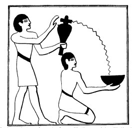

  
[Intangible Textual Heritage](../../index)  [Egypt](../index) 
[Index](index)  [Previous](lfo008)  [Next](lfo010) 

------------------------------------------------------------------------

### THE FOURTH CEREMONY.

The first ceremony removed evil or sin from the body of the deceased,
the second gave it warmth, and the third restored to it the humours
which had been expressed from it. For the fourth ceremony the SEM priest
dissolved five grains of incense made from the salt deposits near the
city of Nekheb, i.e., "Incense of the South," in a libation vase of
water, and, having poured it into a vessel, walked with it four times
round the mummy or statue, and sprinkled it each time. The name given to
this libation water is "Semman," and of the five grains of salt, or
alum, which it contained, one was for Horus, one for Set, one for Thoth,
one for Sep, and one for Osiris, that

p. 57

is, for the deceased himself. Whilst the SEM priest walked round the
statue the Kher heb said the following words four times:--

"\[Here is\] *Semman*! \[Here is\] *Semman*!

"Open thy mouth, O Unas, and taste thou the taste thereof in the halls
of the god, for *Semman* is the emission of Horus, for *Semman* is the
emission of Set,

 

   
The Sem priest pouring water from a libation vase into a libation bowl
held by a ministrant.

 

for *Semman* is the stablisher of the heart of the two Hawk-gods (i.e.,
Horus and Set). Thou art cleansed with *hesmen* (natron), and thou art
like unto the followers of Horus."

The libation thus poured out either represented the essence of Horus and
the essence of Set, which was the

p. 58

source of the strength of their hearts, and the substance which gave
them life, or was believed to be transmuted into that essence through
the words of power spoken by the Kher heb. The power of the *Semman*
water was great, for as soon as it touched the face of the deceased his
mouth was opened, and he was able to taste the emission, or life
essence, of Horus and Set. Having tasted it, his whole being was
changed, and he became a new creature, and henceforth he was a
counterpart of the *Shemsu Heru* or "Followers of Horus." The Horus here
referred to must not be confounded with the twin-brother of Set. The
Horus who is always associated with Set is "Horus the Great," or "Horus
the Elder," the Haroeris of the Greeks, but the Horus mentioned in the
Liturgy in connection with "Followers" is "Horus, the son of Isis."

The "Followers of Horus" were a group of beings who were closely
connected with Osiris, and having "followed" him in this world they
passed after him into the Other World, where they became his ministrants
and messengers, partaking of his immortal nature, and sharing his life.
Horus the Elder was "followed" by a group of beings also, but these were
of a totally different character, for they were called "Mesentiu," i.e.,
"workers in metal," or "blacksmiths." In some texts the followers of
Horus, the son of Isis, are identified with the metal-workers of

p. 59

Horus the Elder, and it is possible that this is the case in the
Liturgy. On the other hand, the deduction to be made from our text seems
to be that the essence of Horus and Set introduced into the body of the
deceased changed his nature into theirs, while the cleansing with natron
made him a counterpart of the followers of Horus, the son of Isis. He
thus possessed the nature of Horus, the oldest god of heaven, and the
nature of a "follower" of the son of the man Osiris, who rose from the
dead and became the ever-living god and judge of the dead.

------------------------------------------------------------------------

[Next: The Fifth Ceremony](lfo010)
