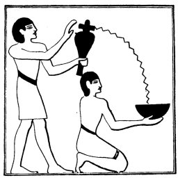

  
[Intangible Textual Heritage](../../index)  [Egypt](../index) 
[Index](index)  [Previous](lfo009)  [Next](lfo011) 

------------------------------------------------------------------------

### THE FIFTH CEREMONY.

The next ceremony continued the process of assimilating the deceased
with the gods. The priest, having dissolved five grains of incense made
from the salt deposit in a place in the Natron Valley called Shet pet,"
"Lake of Heaven," in a libation vase of water, and poured it into a
vessel, walked with it four times round the mummy and sprinkled it each
time. As he did so the Kher heb said the following words four times:

"Thou art purified with natron, and Horus is purified with natron.

"Thou art purified with natron, and Set is purified with natron.

"Thou art purified with natron, and Thoth is purified with natron.

p. 60

"Thou art purified with natron, and Sep is purified with natron.

"Thou art purified with natron, and thou art stablished among them.

"Thy mouth is the mouth of the sucking calf on the day of his birth."

It is possible to translate "Thou art purified with

 

   
The Sem priest pouring water from a libation vase into a libation bowl
held by a ministrant.

 

natron as Horus is purified with natron," &c., as did Dümichen, but it
seems better to render the passage without the addition of "as" in each
member, for it is clear that the salted water was offered as much to the
deceased as to each god. The effect of this sprinkling was to give the
deceased power to take his place with

p. 61

the gods of each of the four quarters of heaven, and to make him their
equal. In the last line of the passage, "Thy mouth is the mouth of the
sucking-calf on the day of his birth," we appear to have an allusion to
the calf figured in the Vignettes to Chapter CIX. of the *Book of the
Dead*, which is entitled "The Chapter of knowing the Souls of the East."
In the Theban Recension we see the deceased standing in adoration before
Ra-Harmachis, between whom and the deceased is a spotted calf. In the
Saïte Recension the deceased stands in adoration before the Boat of Ra,
which is about to pass between the two "Trees of Emerald" into the sky.
In the Boat are: 1. Ra-Harmachis, with the sign for wind above his disk.
2. The deceased. 3. A calf with a star above his back. The text tells us
that the Souls of the East are Ra-Harmachis, the Calf of the goddess
Khera (?), and Neter-tuai, or the planet Venus. The "Sucking-calf" must
therefore be the name of a morning star which was associated with the
rising sun, and with Isis as a morning star. It seems clear, then, that
the passage in the Liturgy signifies that the deceased is identified in
it with the star which was born in the sky at sunrise; as its mother was
Isis the star was a form of Horus, son of Osiris and Isis, and the
deceased is therefore the son of Osiris, that is, Horus.

------------------------------------------------------------------------

[Next: The Sixth Ceremony](lfo011)
