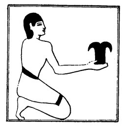
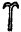

  
[Intangible Textual Heritage](../../index)  [Egypt](../index) 
[Index](index)  [Previous](lfo011)  [Next](lfo013) 

------------------------------------------------------------------------

p. 64

## CHAPTER III.

### THE SEVENTH CEREMONY.

### DESCRIPTION OF THE OFFERINGS.

THE ceremonies of purification are now ended. The new body in which the
KA is to dwell has been made by means of them. Its bones, and head, and
mouth have been brought into a state of ceremonial purity, it contains
the fluid of life, and all its humours, and

 

   
The Sem priest holding the "Kef-pesesh."

 

warmth, and its face is enveloped with an emanation from the Eye of
Horus, and the odour of purity has been restored to it. It is not,
however, prepared to enjoy the offerings which are about to be presented
to it, because its jaw-bones, which have been pressed out

p. 65

of their places under the process of mummification, have no freedom of
movement. To "establish" the jaw-bones was the next thing. The SEM
priest took in his hands the instrument called "KEF PESESH," i.e., "the
overcomer of the divisions," the shape of which was  , and presented it before the
face of the mummy, or touched it with it. Meanwhile the Kher heb said
these words:--

"O Unas, thy two jawbones which were separated have been established."

As the result of these words the jawbones resumed their former
positions, and power was given to them to masticate food. It is
interesting to note that a specimen of this instrument is preserved in
the British Museum (Third Egyptian Room, Table-case M, No. 888). It is
made of flint, and was found near Abydos with large numbers of flint
knives and tools of the Neolithic Period. If the object be a KEF PESESH,
and there is no reason to doubt it, it forms an important proof which
connects this ceremony with the Predynastic Period. Compare also another
example of this amulet, which is surmounted by the head of a goddess, in
the British Museum (Table-case F, Fourth Egyptian Room, No. 505).

------------------------------------------------------------------------

[Next: The Eighth Ceremony](lfo013)
