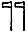
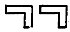
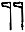
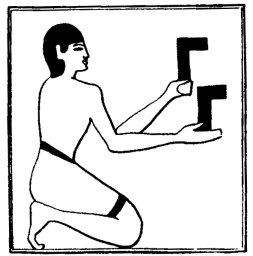
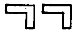

  
[Intangible Textual Heritage](../../index)  [Egypt](../index) 
[Index](index)  [Previous](lfo012)  [Next](lfo014) 

------------------------------------------------------------------------

### THE EIGHTH CEREMONY.

The SEM priest next presented before the face of the mummy two objects
of the shape  , or   made

p. 66

of iron of the South and iron of the North respectively, and the Kher
heb said twice:--

"O Unas, the two gods have opened for thee thy mouth."

The "two gods" are, of course, Horus and Set. It will be noted that in
the text of Unas the two iron objects which represent Horus and Set are
in the form of axe-heads attached to handles,   and that in the

 

   
The Sem priest presenting 
.

 

text of Peta-Amen-apt they are in the form 
. Amulets in both forms are known, for, as Professor
Maspero has pointed out, small axes, with heads of metal and handles of
wood, have been found in the tombs. and also small angles of haematite,
of which many examples exist in our museums. [1](#fn_54) The application of these objects to the
mouth of the mummy was, no

p. 67

doubt, intended to supplement the presentation of the KEF PESESH.

------------------------------------------------------------------------

### Footnotes

[66:1](lfo013.htm#fr_54) E.g., British Museum,
Table-case F, Fourth Egyptian Room, Nos. 510-520.

------------------------------------------------------------------------

[Next: The Ninth Ceremony](lfo014)
