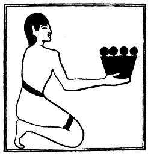

  
[Intangible Textual Heritage](../../index)  [Egypt](../index) 
[Index](index)  [Previous](lfo014)  [Next](lfo016) 

------------------------------------------------------------------------

### THE TENTH CEREMONY.

The SEM priest next brought in a vessel four balls, or round cakes,
called *shaku*, and whilst he presented these the Kher heb said:--

 

   
The Sem priest presenting shaku.

 

O Unas, the SHAKU Of Osiris have been presented unto thee, the SHAKU
from the top of the breast of Horus, of his body hast thou taken to thy
mouth."

The exact meaning of the word shaku is unknown, but it seems clear that
the object symbolized the nipples on the breast of Horus, or the nipples
on the breast of his mother Isis, which the god had taken into his
mouth.

------------------------------------------------------------------------

[Next: The Eleventh Ceremony](lfo016)
