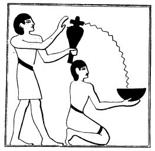
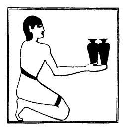

  
[Intangible Textual Heritage](../../index)  [Egypt](../index) 
[Index](index)  [Previous](lfo016)  [Next](lfo018) 

------------------------------------------------------------------------

p. 70

### THE TWELFTH CEREMONY.

The ceremonies symbolizing the nursing of Horus by Osiris having been
performed, the SEM priest took libation vases of pure water of the
north, i.e., from the Delta, not water with natron dissolved in it, and
went

 

   
The Sem priest pouring water from a libation vase into a libation bowl
held by a ministrant.

 

round the mummy, sprinkling it on all sides as he went, whilst the Kher
heb said four times:--

"This libation is for thee, O Osiris, this libation is for thee, O Unas;
it cometh forth from thy son, it cometh forth from Horus.

"I have come and I have brought unto thee the Eye of Horus, that thy
heart may be refreshed therewith.

p. 71

"I have brought it \[and placed it\] under thee, \[under\] thy sandals,
and I have presented unto thee that which floweth forth from thee.
Whilst it is with thee there shall be no stoppage of thy heart, and it
shall be with thee, with the things (or, persons) which come forth at
the \[sound of\] the voice."

The powers which the deceased enjoyed upon earth having now been
bestowed upon him once more, or upon his KA, he is in the position of
being able to

 

   
The Sem priest presenting a vessel of white wine and a vessel of black.

 

partake of the symbolic offerings which are about to be made to him, and
to assimilate them after they have been transformed into spiritual meat
and drink by the words of the Kher heb.

------------------------------------------------------------------------

[Next: The Thirteenth Ceremony](lfo018)
