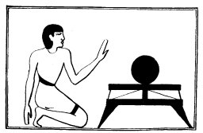

  
[Intangible Textual Heritage](../../index)  [Egypt](../index) 
[Index](index)  [Previous](lfo020)  [Next](lfo022) 

------------------------------------------------------------------------

### THE SIXTEENTH CEREMONY.

The Vignette which illustrates the next ceremony shows us the SEM priest
kneeling before a small table

p. 75

on which rests a bread-cake, which is called "the Uten-cake, for the
lifting up of the face." Whilst this bread-cake is being offered, the
Kher heb said, according to the text of Unas, four times:--

"SUTEN HETEP TA to the KA of Unas."

These words were followed by:--

"Osiris Unas, the Eye of Horus hath been presented unto thee--the bread
which thou eatest."

 

   
The Sem priest offering the Uten cake.

 

According to the text of Peta-Amen-apt the Uten-cake is to be divided
into two equal parts, and the words "Suten hetep ta, to the KA of
Peta-Amen-apt" are to be said four times in connection with each half.
Whilst the SMEN priest offers these the Kher heb says four times:--

"Osiris, the Eye of Horus hath been presented unto thee--the bread which
thou eatest, and thy mouth hath been opened thereby."

It has been said above ([p. 21](lfo004.htm#page_21)) that, though the
words

p. 76

suten hetep ta may at one time have been intended to mean "May the king
give an offering," it is clear they had already lost this meaning when
the funerary texts were inscribed on the mastabas at Sakkarah. The
passage from the text of Unas is an important proof that such is the
case, for it is quite clear that the king is not entreated to give to
Unas an offering. Here the words *suten hetep ta* occur some forty lines
from the beginning of the Liturgy, where, in the ordinary course of
things, we should expect them to appear. From the fact that they are
ordered to be recited four times in one text, and eight times in the
other, we are fully justified in believing that they are the opening
words of a formula which was composed in primitive times and recited by
priests and relatives on behalf of the dead, and that they were used by
pious folk, as Dümichen first pointed out, in much the same way as
"Paternoster" and "Ave Maria" are used in our own times. It may be noted
too in passing that the passage from the Liturgy under consideration
presents us with one of the oldest examples of the use of the formula
"*suten hetep ta en ka en*," "May there be a royal offering to the KA
of," which is so common on stelae from the XIIth Dynasty downwards.

------------------------------------------------------------------------

[Next: The Seventeenth and Eighteenth Ceremonies](lfo022)
