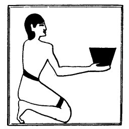

  
[Intangible Textual Heritage](../../index)  [Egypt](../index) 
[Index](index)  [Previous](lfo029)  [Next](lfo031) 

------------------------------------------------------------------------

### THE TWENTY-SIXTH CEREMONY.

This was followed by an offering of an iron vessel

p. 86

containing one *hent* measure of beer, [1](#fn_64) and at the same time the Kher heb said:--

"Unas, the Eye of Horus hath been presented unto thee, which was rescued
for thee; there is no iron therein, and it belongeth to thee."

In the "iron vessel" we may probably see an allusion to the iron spear
with which Horus defended himself against the attack of Set. If this be
so we are to understand from the text that the strength of the iron

 

   
The Sem priest presenting an iron vessel of beer.

 

weapon is transferred to the vessel, which in turn transfers it to the
beer. From the beer the deceased obtains the magical power of Horus
which will enable him to repulse any attack made upon him by Set.

------------------------------------------------------------------------

### Footnotes

[86:1](lfo030.htm#fr_64) Or, "a vessel
containing a *hent* measure of iron beer."

------------------------------------------------------------------------

[Next: The Twenty-seventh Ceremony](lfo031)
