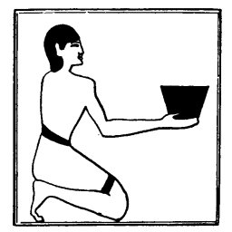

  
[Intangible Textual Heritage](../../index)  [Egypt](../index) 
[Index](index)  [Previous](lfo030)  [Next](lfo032) 

------------------------------------------------------------------------

### THE TWENTY-SEVENTH CEREMONY.

The SEM priest then offered a *hetemet* vessel containing

p. 87

one *hent* measure of beer, [1](#fn_65) and as
he did so the Kher heb said:--

"Unas, the Eye of Horus hath been presented unto thee that thou mayest
be filled therewith."

At this point in the service the SEM priest paused in his presentation
of offerings to the deceased, and made ready to pour out further
libations to him. Having dissolved three cakes of natron in pure water,
he took four vases of the solution, and walked round the

 

   
The Sem priest presenting a stone vessel of beer.

mummy, or statue, and sprinkled it on all sides, whilst the Kher heb
recited the following, words four times:--

"This libation is for thee, O Osiris, this libation is for thee; it
cometh forth from thy son, it cometh forth from Horus.

"I have come and I have brought unto thee the Eye of Horus that thy
heart may be refreshed thereby. I

p. 88

have brought it to thy feet, and have presented unto thee that which
hath flowed and come forth from thee. Whilst it is with thee there shall
be no stoppage of thy heart, and it shall be with thee, with the things
(or, persons) which come forth at the \[sound of\] the voice." [1](#fn_66) (The Vignette is a duplicate of that given
on page 42.)

------------------------------------------------------------------------

### Footnotes

[87:1](lfo031.htm#fr_65) Or, "a vessel
containing a *hent* measure of *hetemet* beer."

[88:1](lfo031.htm#fr_66) From indications given
in the text of Pepi II. it is clear that at this place in the series of
ceremonies articles of apparel and jewellery were offered one by one to
the deceased, and that appropriate words of dedication were recited
during their presentation. See Maspero, Pyramides de Saqqarah, p. 361.

------------------------------------------------------------------------

[Next: The Twenty-eighth To Thirty-fourth Ceremonies](lfo032)
