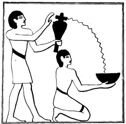

  
[Intangible Textual Heritage](../../index)  [Egypt](../index) 
[Index](index)  [Previous](lfo035)  [Next](lfo037) 

------------------------------------------------------------------------

### THE THIRTY-EIGHTH CEREMONY.

This censing of the mummy, or statue, was followed by another set of
libations. Whilst the SEM priest was sprinkling the deceased with water
in which two grains, or cakes, of incense had been dissolved, the Kher
heb said four times:--

"This libation is for thee, O Osiris, this libation is

p. 97

for thee, O Unas; it cometh forth from thy son, it cometh forth from
Horus.

"I have come and I have brought unto thee the Eye of Horus, that thy
heart may be refreshed therewith. I have brought it \[and placed it\]
under thee, \[under

 

   
The Sem priest pouring water from a libation vase into a libation bowl
held by a ministrant.

 

thy sandals,\] and I have presented unto thee that which floweth forth
from thee. Whilst it is with thee there shall be no stoppage of thy
heart, and it shall be to thee with the things (or, persons) which come
forth at the \[sound of\] the voice."

------------------------------------------------------------------------

[Next: The Liturgy Described](lfo037)
