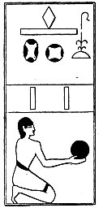

  
[Intangible Textual Heritage](../../index)  [Egypt](../index) 
[Index](index)  [Previous](lfo038)  [Next](lfo040) 

------------------------------------------------------------------------

### THE FORTIETH CEREMONY.

The SEM priest next offered two suten hetep, cakes, or "royal offering
cakes," and the Kher heb said:--

 

   
The Sem priest presenting the two "royal offering" cakes.

 

"Osiris Unas, the Eye of Horus hath been presented unto thee, and he is
content therewith."

------------------------------------------------------------------------

[Next: The Forty-first Ceremony](lfo040)
