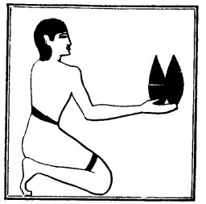

  
[Intangible Textual Heritage](../../index)  [Egypt](../index) 
[Index](index)  [Previous](lfo041)  [Next](lfo043) 

------------------------------------------------------------------------

### THE FORTY-THIRD CEREMONY.

In the next ceremony the priest presented for the *ush*(?) offering a
Tua cake and a Shens cake, whilst the Kher heb said:--

"Osiris Unas, the Eye of Horus hath been presented

p. 105

unto thee, and it hath been made to approach thy mouth for thee."

 

   
The Sem priest presenting the Tua and Shens cakes.

 

------------------------------------------------------------------------

[Next: The Forty-fourth Ceremony](lfo043)
