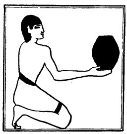

  
[Intangible Textual Heritage](../../index)  [Egypt](../index) 
[Index](index)  [Previous](lfo044)  [Next](lfo046) 

------------------------------------------------------------------------

### THE FORTY-SIXTH CEREMONY.

A vessel of Tchesert drink was next presented, and the Kher heb said:--

"Osiris Unas, the Eye of Horus hath been presented unto thee, the little
one, which became the food of Set (or, which entered into Set)."

The "little" Eye of Horus here referred to seems to be the moon, which,
as already mentioned, was devoured piecemeal by Set after the fourteenth
day each month.

p. 107

The passage in the Liturgy suggests that Set must, on one occasion, have
found the new moon in the sky,

   
The Sem priest presenting a vessel of drink.

when he was roaming through the night, and swallowed it.

------------------------------------------------------------------------

[Next: The Forty-seventh Ceremony](lfo046)
