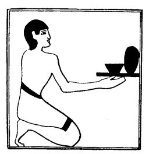

  
[Intangible Textual Heritage](../../index)  [Egypt](../index) 
[Index](index)  [Previous](lfo046)  [Next](lfo048) 

------------------------------------------------------------------------

### THE FORTY-EIGHTH CEREMONY.

In the next ceremony a bread-cake and a vessel of beer were placed on a
small table, and "lifted up" before the mummy, whilst the Kher heb
said:--

 

   
The Sem priest presenting a bread cake and a vessel of beer.

 

"Osiris Unas, the Eye of Horus hath been presented unto thee, and it
hath been lifted up for thee to thy face. There shall be lifting up to
thy face, there shall be lifting up to thy face, O Osiris. Hail, Unas!
let thy soul advance.

"Lift up thy face, O thou Unas, and look afar off, and fix thy gaze
intently upon that which cometh forth from thee. That which was
corruptible in thee

p. 109

hath been washed away, O Unas, and thy mouth hath been made holy for
thee by the Eye of Horus."

------------------------------------------------------------------------

[Next: The Forty-ninth Ceremony](lfo048)
